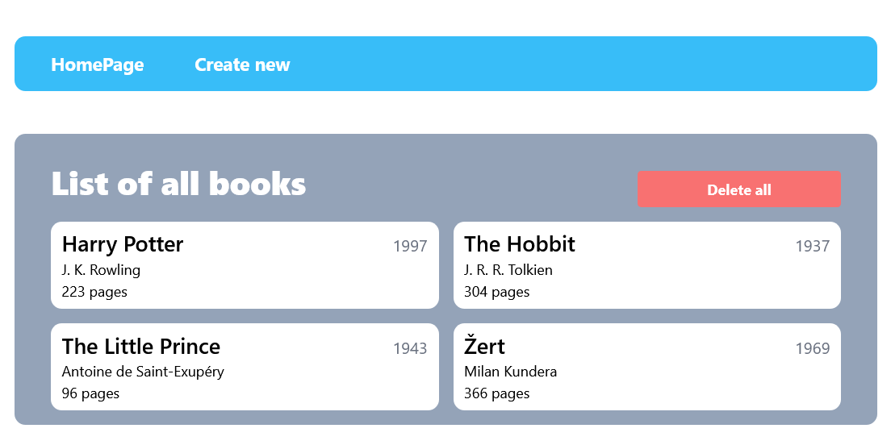
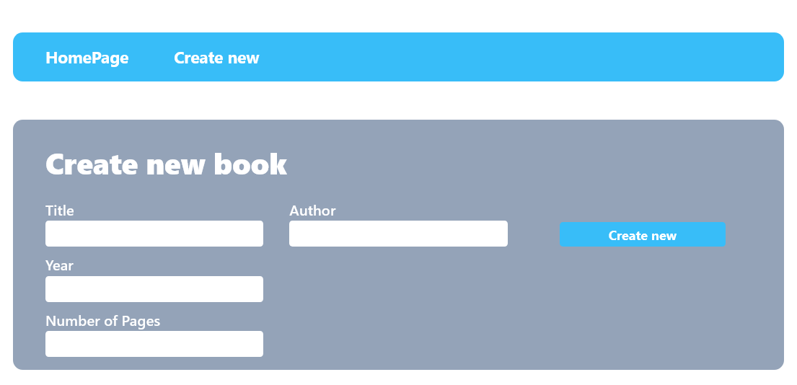
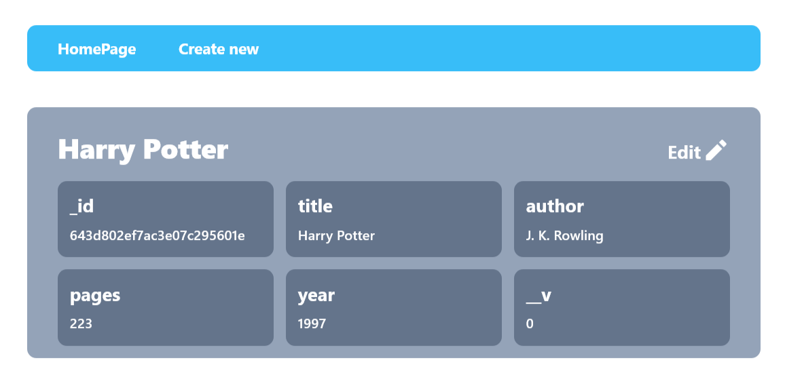
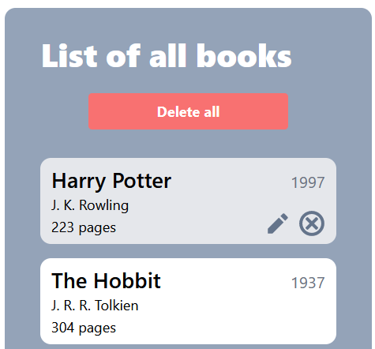

# BookCRUD Example

- Example project for my final exams.
- Fully responsive design
- Ability to create, read, delete and update data


### Create book page

<table>
<tr>
<th> Destop </th>
<th> Mobile </th>
</tr>
<tr>
<td>



</td>
<td>


</td>
</tr>
</table>

### View book page



<table>
<tr>
<th> Editing page </th>
<th> Hover effect on Home page </th>
</tr>
<tr>
<td>


</td>
<td>



</td>
</tr>
</table>

## Installation

- Clone repository 
```
git clone https://github.com/RadekPelikan/BookCRUD.git
cd bookCRUD
```
- Create `.env` file in [backend directory](./backend/)
```python
# Example of url:
# mongodb+srv://<DB_USER>:<DB_PASSWORD>@<DB_NAME>.mongodb.net/?retryWrites=true&w=majority
DB_PASSWORD=password    # Database password
DB_USER=admin           # Database user
DB_NAME=cluster0.dopig  # Database cluser name
# PORT is optional
PORT=3030               # PORT which the backend runs on
``` 

## Technologies

- nodejs, npm
- JS, TS
- React, Vitejs
- Express
- MongoDB, mongoose
- React icons
- TailwindCSS
- axios
- nodemon